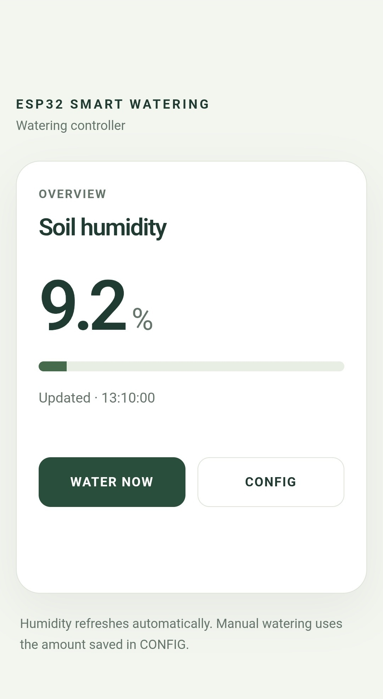
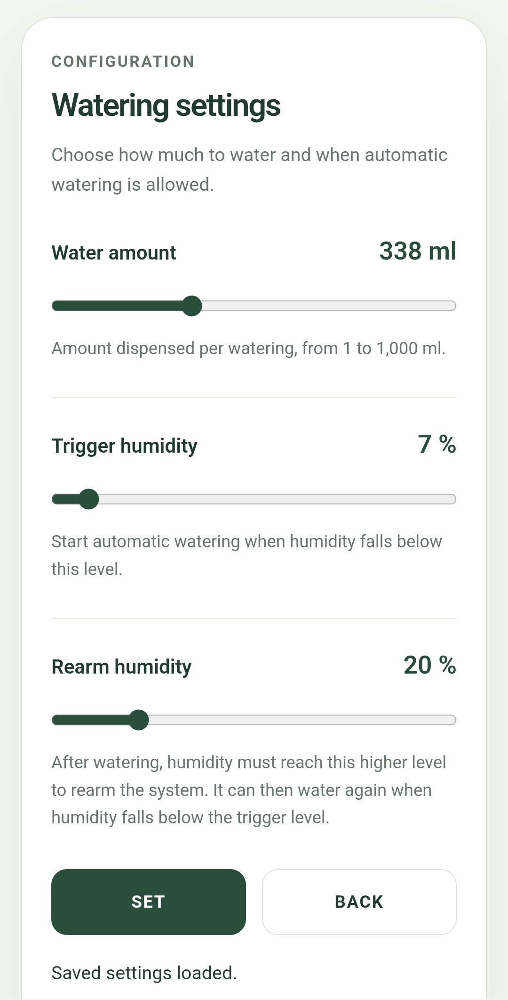
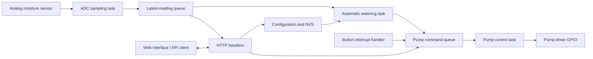
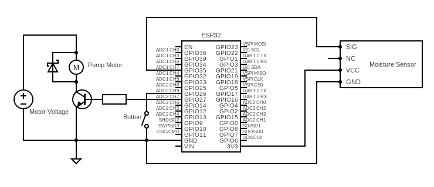
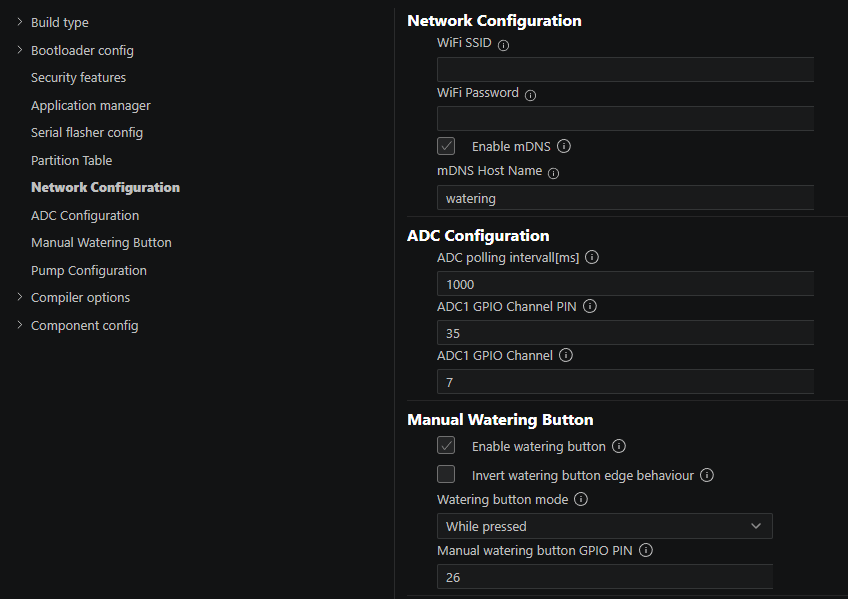

# ESP32 Smart Watering

An embedded C project for the ESP32, built with ESP-IDF and FreeRTOS. The firmware combines periodic soil moisture measurement, automatic pump control, persistent configuration, and a browser-based interface served directly by the microcontroller.

The project explores embedded task coordination, interrupt-driven input, peripheral integration, and HTTP communication within a single application.

## Functionality

- Automatic watering with separate trigger and rearm thresholds.
- Manual watering requests from the web interface or a GPIO button.
- Browser-based moisture display and watering configuration.
- JSON HTTP API for reading status and updating settings.
- Persistent watering settings using ESP32 nonvolatile storage (NVS).
- Build-time configuration of pins, timing, calibration, and button behavior through Kconfig.
- Wi-Fi connectivity and mDNS hostname discovery.

## Web interface

<p align="center">
  
  
</p>

The dashboard displays the current reported moisture value and provides a manual watering control. The configuration page exposes the watering amount and both moisture thresholds. HTML pages are embedded in the firmware at build time and served by `esp_http_server`.

## Firmware architecture

The application separates measurement, watering decisions, and pump actuation into three FreeRTOS tasks. HTTP handlers and the button interrupt handler provide additional control inputs.



| Module | Responsibility |
|---|---|
| [`main/main.c`](main/main.c) | Initializes NVS, measurement, watering, and networking |
| [`main/measurements.c`](main/measurements.c) | Configures ADC sampling and button interrupts; exposes the latest measurement |
| [`main/watering.c`](main/watering.c) | Implements automatic watering and pump control tasks; manages watering configuration and persistence |
| [`main/http_server.c`](main/http_server.c) | Initializes Wi-Fi and mDNS; serves HTML pages and JSON API endpoints |
| [`main/web/`](main/web/) | Contains the dashboard and configuration pages |
| [`main/Kconfig.projbuild`](main/Kconfig.projbuild) | Defines firmware configuration options |

### Task communication

The ADC task periodically samples the sensor and overwrites a single-element queue. Consumers can read the latest available measurement without accumulating a backlog of old samples.

Watering decisions and manual requests are passed to the pump control task through a second single-element queue. Commands represent a timed run, a start request, or a stop request. The queue uses overwrite semantics, so a new pending command can replace an earlier pending command; it is not a history of every request.

Shared pump state and watering parameters use C atomic variables. This provides atomic access to individual values, but does not make an update of several configuration fields a single transaction.

The button uses GPIO edge interrupts to request pump actions. The intended behavior is selectable between running while pressed and requesting a predetermined watering duration.

### Automatic watering state machine

The watering task uses separate trigger and rearm thresholds:

1. It starts armed and requests a timed watering cycle when the reading is at or below the trigger threshold.
2. After that request, it disarms automatic watering.
3. It rearms when the reading rises above the rearm threshold.

With the rearm threshold above the trigger threshold, this hysteresis prevents repeated automatic requests while the reading remains below the trigger. If the reading never exceeds the rearm threshold, automatic watering stays disarmed. A restart initializes the state as armed again.

Manual requests are handled separately from this state machine.

### Configuration and persistence

Configuration is divided into two layers:

| Layer | Examples | Storage |
|---|---|---|
| Build-time configuration | Wi-Fi credentials, GPIO assignments, sampling intervals, button mode, calibration constants | Kconfig / generated firmware configuration |
| Runtime configuration | Watering amount, trigger threshold, rearm threshold | Atomic variables, persisted in NVS |

Runtime settings are represented internally as pump duration and raw ADC thresholds. On startup, the firmware loads saved values or falls back to configured defaults. The API converts these internal values to milliliters and moisture percentages for the interface.

### Measurement and delivery model

The current implementation uses simple linear conversions:

```text
estimated_water_ml = K × pump_on_time_ms
reported_moisture_pct = L × raw_ADC_reading
```

K represents estimated pump flow in mL/ms. L scales the ADC reading into a relative moisture percentage. Both constants depend on the components used; the displayed percentage represents a relative sensor scale.

The sensor model currently has no offset or two-point calibration and assumes lower readings correspond to drier soil. Water delivery is estimated from runtime, with no flow sensor feedback.

## HTTP API

The default base address is `http://watering.local`. The API exposes the same status and configuration used by the web interface.

| Endpoint | Method | Purpose | Successful response |
|---|---|---|---|
| `/api/status` | GET | Read moisture and pump state | `200 OK`, JSON |
| `/api/water` | POST | Request watering for the configured amount | `202 Accepted`, empty body |
| `/api/config` | GET | Read watering settings | `200 OK`, JSON |
| `/api/config` | POST | Apply and save all three watering settings | `204 No Content`, empty body |

Example status response:

```json
{
  "humidity_pct": 25.0,
  "watering": false
}
```

Example configuration response or update payload:

```json
{
  "water_amount_ml": 100,
  "trigger_humidity_pct": 20,
  "rearm_humidity_pct": 40
}
```

Configuration updates use `Content-Type: application/json` and include all three fields. Manual watering requests require no body. The `humidity_pct` names refer to soil moisture in this API. The values above illustrate the JSON format.

## Hardware design

The hardware design consists of an ESP32, an analog soil moisture sensor, a pump with a transistor driver and separate motor supply, and a manual push button.

<p align="center">
  
</p>

| Signal | Default assignment |
|---|---|
| Sensor analog output | GPIO35 / ADC1 channel 7 |
| Pump driver control | GPIO27, active high |
| Manual button | GPIO26, internal pull-up, button connected to ground |

## Build and configuration

Open an ESP-IDF terminal in the project directory. For a fresh checkout targeting the original ESP32:

```sh
idf.py set-target esp32
idf.py menuconfig
idf.py build
```

The component manifest in [`main/idf_component.yml`](main/idf_component.yml) declares the cJSON and mDNS dependencies. Configure the Wi-Fi credentials, GPIO assignments, and project settings through `menuconfig` or the ESP-IDF extension for VS Code.

<details>
<summary>Configuration editor screenshot</summary>

<p align="center">
  
</p>

</details>

To flash the firmware and open the serial monitor:

```sh
idf.py -p PORT flash monitor
```

Replace `PORT` with the board's serial port. Once connected to Wi-Fi, the configured interface address is `http://watering.local`; the serial log also reports the assigned IP address.


